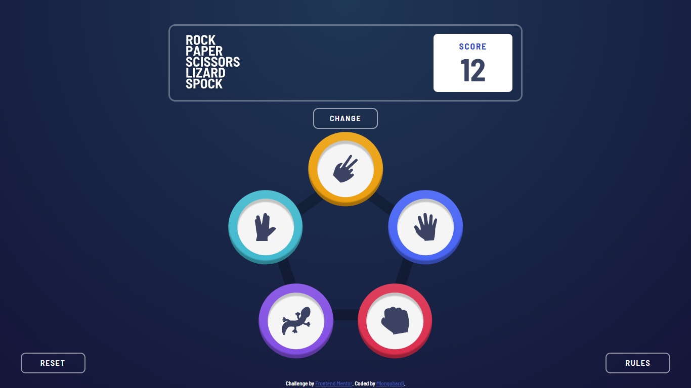

# Frontend Mentor - Rock, Paper, Scissors solution

This is a solution to the [Rock, Paper, Scissors challenge on Frontend Mentor](https://www.frontendmentor.io/challenges/rock-paper-scissors-game-pTgwgvgH). Frontend Mentor challenges help you improve your coding skills by building realistic projects. 

## Table of contents

- [Overview](#overview)
  - [The challenge](#the-challenge)
  - [Screenshot](#screenshot)
  - [Links](#links)
- [My process](#my-process)
  - [Built with](#built-with)
  - [What I learned](#what-i-learned)
  - [Continued development](#continued-development)
  - [Useful resources](#useful-resources)
- [Author](#author)

## Overview

### The challenge

Users should be able to:

- View the optimal layout for the game depending on their device's screen size
- Play Rock, Paper, Scissors against the computer
- Maintain the state of the score after refreshing the browser
- **Bonus**: Play Rock, Paper, Scissors, Lizard, Spock against the computer

### Screenshot



### Links

- Solution URL: [https://github.com/MLongobardi/FEM-rock-paper-scissors](https://github.com/MLongobardi/FEM-rock-paper-scissors)
- Live Site URL: [https://fem-rock-paper-scissors-lizard-spock-mlongobardi.vercel.app/](https://fem-rock-paper-scissors-lizard-spock-mlongobardi.vercel.app/)

## My process

### Built with

- Semantic HTML5 markup
- CSS custom properties
- Flexbox
- CSS Grid
- Mobile-first workflow
- [Svelte](https://svelte.dev/) - JS framework
- [Sveltekit](https://kit.svelte.dev/) - Svelte framework

### What I learned

I decided to do this challenge with Svelte to familiarize myself with this fun framework. It is also the first project I do from scratch so I learned how to create one from the console, and gave some thought on how to organize my folder structure.

Because of Svelte's nature, each component has its relative HTML, CSS and JS all included in a single file. Instead of repeating the same, multiple media queries for every component, I decided to use Svelte's bind functionality to listen to window width changes, and use that to apply a class to the body depending on specific breakpoints I wrote in a config file. In this way, when writing css that determines how a component looks on larger screen sizes (with a mobile-first approach), I could do it like this:

```css
.my-div {
  /*rules for mobile*/
}

:global(:is(.media-M, .media-L, .media-XL)) .my-div {
  /*rules for larger screen sizes*/
}
```

This allows me to, for example, change the breakpoints in the config file, and know that the change will correctly apply everywhere, instead of having to edit every single media query in every single component. I am particularly thankful to the ```:is()``` css selector, which avoided unwieldy style names.

### Continued development

I noticed after a certain point that using em units and setting different font sizes for different screen sizes was an easier way to make the app responsive. In hindsight, I should have set font sizes once on the root element, and then used rem units instead of em. I could do it in this way:

```js
<svelte:head>
	{@html `<style> :root {font-size: ${fontSize + "px"}}	</style>`}
</svelte:head>
```
Giving fontSize a default value and then updating it for greater screen sizes.
Furthermore, putting the logic for detecting screen size in a separate store could allow me to access that information on the components that need it and use it on the html/js side of things, it could be done with window.matchMedia.

### Useful resources

- [Svelte tutorial](https://svelte.dev/tutorial/basics) and [Svelte docs](https://svelte.dev/docs) - For obvious reasons. I found these to be really well done, though I still need to finish a few sections.

## Author

- GitHub - [@Mlongobardi](https://github.com/MLongobardi)
- Frontend Mentor - [@Mlongobardi](https://www.frontendmentor.io/profile/MLongobardi)
